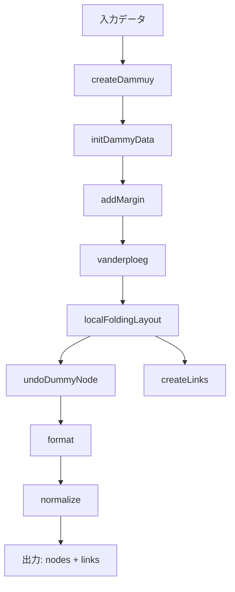

# 列管理版ノードリンク図レイアウト — 実装詳細

## 概要

可変サイズのノードを持つ根付き木を、指定された矩形領域（`width × height`）に収まるようにレイアウトするアルゴリズム。兄弟の葉ノード群を**ダミーノード**にまとめ、ダミーノード内を**列管理 + 焼きなまし法（SA）**で最適化し、さらに**極大ノードの幅拡張**で面積効率を改善する。

---

## 全体フロー



### ステップ詳細

| # | 関数名 | 役割 |
|---|--------|------|
| 1 | `createDammuy` | 兄弟の葉ノードを**ダミーノード**にまとめる |
| 2 | `initDammyData` | ダミーノード内を1列の2次元配列に初期化 |
| 3 | `addMargin` | 全ノードにマージン（`xMargin`, `yMargin`, `innerYMargin`）を付与 |
| 4 | `vanderploeg` | van der Ploeg のアルゴリズムで初期レイアウト |
| 5 | `localFoldingLayout` | アスペクト比を目標に近づけるため、ダミーノードの列数を段階的に増やす |
| 6 | `undoDummyNode` | ダミーノードを展開し、内部の葉ノードに最終座標を設定 |
| 7 | `createLinks` / `createDummyLinks` | ノード間のパス（エッジ）を生成 |
| 8 | `format` | マージンを差し引いた表示サイズを計算 |
| 9 | normalize | 全体を `width × height` にスケーリング |

---

## Step 1: ダミーノードの作成 (`createDammuy`)

```
入力ツリー:            ダミーノード化後:
    Root                    Root
   / | \                  /    \
  A  B  C               [A,B,C]  D
  |                       (dummy) |
  D                               E
  |
  E
```

- 兄弟の**葉ノード**（子を持たないノード）を1つの**ダミーノード**にまとめる
- ダミーノードは `leaves` プロパティに葉の配列を持つ
- 子を持つノード（サブツリーのルート）はそのまま残る
- ダミーノード内のノードには `isInner: true` フラグと `innerYMargin` が適用される

---

## Step 2-3: 初期化とマージン

- `initDammyData`: ダミーノードの `leaves` を `[[全ノード]]`（1列）に初期化
- `addMargin`: 各ノードに余白を追加
  - 通常ノード: `width += xMargin`, `height += yMargin * 2`
  - ダミーノード内ノード: `width += xMargin`, `height += innerYMargin * 2`
  - `innerYMargin = yMargin / 2` （ダミーノード内は密に配置）

現在の設定値:
```javascript
xMargin = 500;
yMargin = 500;
innerYMargin = 250;  // yMargin / 2
```

---

## Step 4: van der Ploeg アルゴリズム (`vanderploeg`)

可変サイズノード対応のツリーレイアウトアルゴリズム。

1. 各子サブツリーを左から順に配置
2. **左輪郭 / 右輪郭**を計算し、サブツリー間の最小距離を決定（`separate`）
3. 親ノードのx座標を子の中央に配置

重要な関数:
- `rightCountur` / `leftCountur`: サブツリーの右端/左端の輪郭ノードリストを返す
- `separate`: 左兄弟の右輪郭と現在のサブツリーの左輪郭を比較し、必要な移動距離を計算
- `rightMostSiblingNode` / `leftMostSiblingNode`: 兄弟中の最右端/最左端ノードを返す

---

## Step 5: localFoldingLayout — 列数の段階的増加

アスペクト比 `a = layoutWidth / layoutHeight` を目標 `at = width / height` に近づける。

```
while (a < at):                         # まだ縦長すぎる
  bottomNode = 最も底辺のダミーノード

  if (columns >= leavesNum):            # 列数が最大
    → 極大ノードの幅拡張を試みる        # ★ 新機能
  else:
    → columns += 1
    → saColumnWithWidening で列分配      # ★ 新機能

  → setDummyMargin で再計算
  → vanderploeg で再レイアウト
  → アスペクト比を再計算
```

### 焼きなまし法によるSA列分配 (`saColumn`)

ダミーノード内の葉ノードを `colNum` 列に分配し、**最大列高さを最小化**する。

```
SA パラメータ:
  initialTemp:      916.57
  finalTemp:          8.82
  coolingRate:        0.9534
  iterationsPerTemp:  102
```

- **初期解**: 各列に最低1ノード + 残りをランダム割当
- **近傍操作**: 1ノードを別の列に移動（空列を作らない制約あり）
- **評価関数**: `max(各列の高さ合計)` を最小化
- **受理判定**: メトロポリス基準（改善なら常に受理、悪化なら確率的に受理）

---

## ★ 極大ノードの幅拡張

### 問題

ダミーノード内に1つ極端に高さの大きいノードがある場合、どの列に配置してもそのノードの高さが全体の高さを支配し、他の列に大きな空白が生まれる。

```
例: 葉 = [A(h=2000), B(h=300), C(h=250), D(h=350), E(h=200), F(h=400)]
3列の最善分配:
  列1: [A] → h=2000    ← Aが支配
  列2: [B,D,F] → h=1050
  列3: [C,E] → h=450
  max = 2000
```

### 解法: 3つの関数

#### 1. `detectMaximalNode(leaves1D)`

極大ノードを検出する。

```javascript
検出条件: maxHeight >= avgHeight * 2
```

- 全葉の高さの平均を計算
- 最大高さが平均の2倍以上なら「極大ノード」と判定
- 該当ノードのインデックスと参照を返す

#### 2. `widenMaximalNode(node, otherLeaves, colNum)`

面積保存でノードを横長にリシェイプする。

```javascript
残りノードの理想列高さ = Σ(他の葉の高さ) / (colNum - 1)
k = min(極大ノードの高さ / 理想列高さ, 4.0)

if (k <= 1.2) → 拡張不要（null を返す）

新width  = 元width × k
新height = 元height / k    // 面積保存: width*height = 一定
isWidened = true            // 二重拡張防止フラグ
```

#### 3. `saColumnWithWidening(leaves, colNum)`

極大ノード対応版のSA列分配。

```
1. 通常SAを実行 → normalResult
2. 極大ノードを検出
3. 検出されたら幅拡張を計算
4. 極大ノードを専用列に固定、残りを (colNum-1) 列でSA
5. 通常SA vs 幅拡張版を比較 → 良い方を採用
```

### 具体的な改善効果

```
Before (幅拡張なし):
  列1: [A(h=2000)]     列2: [B,D,F(h=1050)]  列3: [C,E(h=450)]
  max = 2000

After (Aを幅拡張, k=2.67):
  列1: [A(w=2670,h=750)]  列2: [B,D(h=650)]  列3: [C,E,F(h=850)]
  max = 850   ← 2000 → 850 に改善！
```

### localFoldingLayout での統合

幅拡張は2つのタイミングで適用される:

1. **列数増加時**: `saColumnWithWidening` 内で自動的に極大ノードを検出・拡張
2. **列数が最大に達した後**: `localFoldingLayout` 内で直接幅拡張を試みる（`isWidened` フラグで1回のみ）

---

## Step 6: ダミーノードの展開 (`undoDummyNode`)

ダミーノードを解体し、内部の葉ノードに最終的な `(x, y)` 座標を設定する。

### 配置パターン

**1列の場合:**
```
┌─────────────────┐
│ ─── 水平線      │
│  │              │
│  │  ┌────┐      │
│  ├──┤ A  │      │
│  │  └────┘      │
│  │  ┌────┐      │
│  ├──┤ B  │      │
│  │  └────┘      │
│  │  ┌────┐      │
│  └──┤ C  │      │
│     └────┘      │
└─────────────────┘
縦線の左端 → 横線 → ノード
```

**複数列の場合:**
```
┌──────────────────────────────────┐
│ ── 水平主線 ──────               │
│  │           │          │        │
│  │  ┌────┐   │  ┌────┐  │  ┌───┐│
│  ├──┤ A  │   ├──┤ C  │  ├──┤ E ││
│  │  └────┘   │  └────┘  │  └───┘│
│  │  ┌────┐   │  ┌────┐  │       │
│  └──┤ B  │   └──┤ D  │  │      ││
│     └────┘      └────┘  │       │
└──────────────────────────────────┘
各列に縦線、そこから横線で各ノードに接続
```

**全展開の場合 (columns === leavesNum):**
```
┌──────────────────────────────────┐
│ ── 水平主線 ──────────           │
│  │     │     │     │     │       │
│  A     B     C     D     E       │
└──────────────────────────────────┘
各ノードが独自の列に1つずつ横並び
```

---

## Step 7: パスの描画 (`createLinks` / `createDummyLinks`)

### 通常ノード間のパス

```
     [親ノード]
         │ 縦線 (親の下端 → 水平線Y)
   ──────┼────── 水平線 (左端子〜右端子)
   │     │     │
   │     │     │ 縦線 (水平線Y → 子の上端)
  [子1] [子2] [子3]
```

- 水平線のY座標: 親の下端と子の上端の中間点

### ダミーノード内のパス

列構造に応じて縦線・横線を配置（上記の配置パターン参照）。
幅拡張ノードも通常の列と同じパス構造で接続される。

---

## Step 8-9: フォーマットと正規化

### format
マージンを差し引いた**表示サイズ**を計算:
```javascript
node.width  = node.data.width  - xMargin
node.height = node.data.height - marginY * 2
// marginY = isInner ? innerYMargin : yMargin
```

### normalize
全ノードとリンクを `width × height` の指定領域にスケーリング:
```javascript
scale = min(width / layoutWidth, height / layoutHeight)
node.x = (node.x - left - layoutWidth/2) * scale + width/2
node.y = (node.y - top - layoutHeight/2) * scale + height/2
```

---

## ファイル構成

| ファイル | 役割 |
|----------|------|
| [App.jsx](file:///Users/yoshizakishuma/Documents/zemi/rooted-tree-drawing/src/App.jsx) | データ読み込み・変換、UI |
| [Tree.jsx](file:///Users/yoshizakishuma/Documents/zemi/rooted-tree-drawing/src/Tree.jsx) | SVG描画コンポーネント |
| [saColumnLayout.js](file:///Users/yoshizakishuma/Documents/zemi/rooted-tree-drawing/src/saColumnLayout.js) | **メインのレイアウトアルゴリズム**（本ドキュメントの対象） |
| [layout.js](file:///Users/yoshizakishuma/Documents/zemi/rooted-tree-drawing/src/layout.js) | 行管理版レイアウト（旧版、未使用） |
